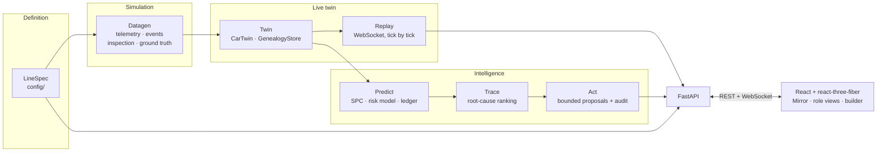

# 🏭 Lineage

**A live digital twin of a vehicle assembly line** — synthetic sensor data streams in real time, and a chain of Predict → Trace → Act modules turns that stream into risk scores, root-cause traces, and bounded, auditable correction proposals.


> Nothing here hardcodes a station count, a layout shape, or a sensor mix. Every station, every conveyor segment, every lamp on screen is drawn straight from a `LineSpec` — swap in a differently-shaped line and the whole system just follows.

## 🔍 What it actually does

Load a run, and 42 stations start ticking in real time in the browser — cars moving down the line, health lamps flipping color, buffers filling. Seed a defect at one station and it surfaces dozens of stations later at inspection, exactly the way a real plant hides problems until they're expensive. Then:

- **Predict** scores every car against a trained model and keeps score of its own alarms — precision, recall, false-alarm rate, a trust score — against what the run's own inspection data says actually happened.
- **Trace** takes a flagged car and ranks every upstream station by how much its readings deviated, naming the most likely origin and the cohort of other cars quietly exposed to the same thing.
- **Act** turns that into one bounded, envelope-checked proposal — never a rewrite of the line, a nudge back toward baseline — with a read-only analytical projection of what it should do, and an append-only JSONL audit trail once someone approves it. An approved value becomes that parameter's setpoint, so the next proposal moves from where the line actually is.

Run `scripts/demo.py` and it narrates all of this against a real seeded scenario, printing real numbers pulled live from the running system — nothing in the demo is scripted output.

## 🗺️ Architecture at a glance



| Layer | What it does |
|---|---|
| `backend/lineage/config/` | `LineSpec`/`StationSpec`/etc. — the plant definition everything else reads |
| `backend/lineage/datagen/` | Generates a run's `telemetry.csv`/`events.csv`/`inspection.csv`/`ground_truth.json` from a `LineSpec` + `RunConfig`, with seeded defect scenarios |
| `backend/lineage/twin/` | `CarTwin`/`GenealogyStore` — the object history a run's data gets ingested into |
| `backend/lineage/replay/` | Streams a loaded run's live state over a WebSocket, tick by tick |
| `backend/lineage/predict/` | SPC, a trained risk model, and a prediction ledger tracking whether each alarm materialized |
| `backend/lineage/trace/` | Root-cause tracing: given a flagged car, ranks upstream stations by deviation strength |
| `backend/lineage/act/` | Turns a trace result into a bounded, envelope-checked proposal with an immutable audit trail |
| `backend/lineage/api/` | FastAPI app exposing all of the above |
| `frontend/` | React + react-three-fiber Mirror scene, role views, and a station builder |

## 🚀 Setup

```
make install
```

Installs the backend (editable, with dev extras) and the frontend's npm dependencies.

Requires Python 3.11+ and Node. On macOS, XGBoost also needs the OpenMP runtime: `brew install libomp` (without it, `import xgboost` fails with a `libomp.dylib` dlopen error).

## ▶️ Running

```
make dev-backend    # FastAPI on :8000
make dev-frontend   # Vite dev server on :5173
```

or `make dev` to run both together. Open the frontend URL, then use the "Load a run..." selector in the top bar (see **Generating data** below if none are listed).

## 🏗️ Generating data

```
make gen
```

Builds `default_400_car_run`: 400 cars over the bundled 42-station example line, with three named seeded scenarios (a torque drift, a paint-booth environmental excursion, an unflagged operator-handover shift), plus a low-rate background of unrelated material-quality noise. Deterministic — same seed, same output, every time.

Training a risk model is a separate script. The `risk_v1` model is committed on purpose (training takes minutes — far too heavy for boot, and a fresh deploy needs the artifact present), so this is only needed to retrain:

```
backend/.venv/Scripts/python.exe scripts/train_risk_model.py
```

## 🎬 Demo

```
backend/.venv/Scripts/python.exe scripts/demo.py       # Windows
backend/.venv/bin/python scripts/demo.py               # macOS/Linux
```

A six-beat narrated walkthrough, built entirely around the real seeded torque-drift scenario in `default_400_car_run` — every id, timestamp, and number it prints is read from that run or fetched live from the running API, never hardcoded:

1. **Mirror** — loads the run live, the browser starts ticking.
2. **Predict & the Ledger** — real precision/recall/trust-score for the station that actually caught the drift.
3. **Trace** — root-causes a flagged car back through the line via `GET /api/trace/{car_id}` (the same endpoint the car panel's "Trace root cause" button calls) and names the exposed cohort.
4. **Act** — lists, simulates, and approves a bounded correction through the same `/api/act` endpoints the Floor Supervisor screen uses, audit trail included.
5. **Leadership** — a real `GET /api/view/leadership` call: no live per-station state, just cost rollups and the sensor-retrofit shortlist the browser turns into a payback/rollout panel.
6. **Builder** — a real mid-line station insert, proving the station count and sequencing actually change.

Assumes the backend is already running and the frontend is open in a browser — it drives the API and prints narration for a live presenter, pausing for Enter between beats. Pass `--auto` to run unattended instead (a quick preview, or a smoke test). Every beat goes through the public API — there is no demo-only code path.

## ✅ Testing and linting

```
make test    # backend: pytest -q
make lint    # backend: ruff check .
```

Frontend: `cd frontend && npx tsc --noEmit && npx vitest run`.

## 📝 Stated assumptions and scope decisions

A running list of judgment calls made while building this, kept honest rather than silently baked in:

- **Role views** (`GET /api/view/{role}`) reshape and filter the live line state per role, and the Floor Supervisor view additionally carries Predict's SPC alarms, high-risk cars (with confidence), and bottleneck warnings. Operator sees exactly one station; Leadership gets no live per-station state at all — cost rollups plus the retrofit shortlist — enforced by the response model itself, not by the frontend choosing not to render fields.
- **The station builder** covers insert/remove/reorder/save. Drag-and-drop reordering (buttons instead), a dedicated sensor-editor screen (an inline repeater instead), a commissioning wizard with "run to learn", and a visual 2D layout editor (plain numeric x/y fields instead) were cut as separately-scoped, bigger follow-ups.
- **Prediction Ledger `trust_score`** is defined as F1 (the harmonic mean of precision and recall) — a standard, defensible single-number summary, not a domain-specific formula. There is no one fixed definition of "trust score"; this is a named judgment call, not an implicit one.
- **A station with no sensor, or a prediction below its coverage threshold, is `UNKNOWN_RISK`** — never a numeric level and never treated as safe. Any metric with a zero denominator (e.g. precision with no alarms raised at all) is `None`, never a fabricated `0.0`.
- **Act proposals never leave the safety envelope** in `backend/lineage/act/envelope.py`; `simulate()` is a read-only analytical projection — it writes nothing, and its confidence intervals are stated model assumptions, not empirically fitted (a full datagen re-run on a forked spec is the honest upgrade path).
- **Trace and Act are wired end-to-end**: `GET /api/trace/{car_id}` powers the car panel's "Trace root cause", and `/api/act/proposals` (+ `/simulate`, `/approve`) power the Floor Supervisor's proposal list. Proposals are deduped by (station, parameter); approval is idempotent; the audit trail is append-only JSONL under `backend/data/audit/` and survives a restart.
- **Prediction Ledger counts abstentions**: every UNKNOWN_RISK assessment is tallied per station (the "Abstained" column), so "how often the model honestly said 'I don't know'" is itself a measured, per-station number — not a silent drop.

## ⚠️ Known limitations

- **`RunData` and `assess_risk`'s feature builder scan more of a run's data as simulated time advances**, rather than using an index. Measured costs: `current_state()` went from near-instant to 4-8s over a single loaded run (mitigated in the role-view/Mirror endpoints by reusing the last broadcast snapshot instead of recomputing, and the tick loop now runs it off the event loop via `asyncio.to_thread` with exception handling, so a slow or failing tick degrades the tick rate instead of freezing every request); building the full prediction ledger for a 400-car run measured ~105s (mitigated by building it lazily on first request instead of at 'load' time, then caching it). The underlying scan-cost pattern itself is unfixed — a real refactor candidate (pre-sorted/indexed lookups, matching how `GenealogyStore` already uses `bisect`), flagged rather than attempted here.
- **Act's "current value" is the last approved setpoint, or the range midpoint before any approval** — there is no live OT/PLC link to read a real setpoint from, and the rationale says so whenever the midpoint assumption is in play.
- *(Fixed)* Car clicks in the Mirror scene previously resolved to the station behind the car — an `InstancedMesh` bounding-sphere caching issue. `Car3D.tsx` now recomputes the sphere per frame, and an e2e test clicks a moving car so a regression fails CI.
